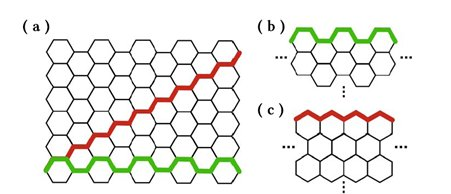

<h2>Topological Condensed matter: Lecture 28th February </h2>

### Quick Summary
We are interested in the edge modes of the Graphene Nano Ribbon. A nano ribbon is a 2D structure in which the molecules extend infinitely in one of the directions and is finite in the other. One more visualizations of the above is forming a chain of atoms(Periodic boundary conditions) in one of the directions and finite chain(Open boundary conditions) in the other direction.

### Two kinds of Nano Ribbon

One of the ways to obtain the nano ribbon structure is to terminate of cut the Graphene in one direction of an extended Graphene layer. We can end up in two kinds of the structures:

- Zig Zag structure
- Arm Chair structure

The above image depicts the situation stated above. The fig (a) shows the directional dependence cutting choice of the Graphene structure. Depending on our two choices indicated by the Red and Green coloured path, we end up in Zig-zag structure (c) or Arm-Chair structure (d).

> **Aim:** We would like to obtain the energy spectrum and edge states in the above two scenarios.

#### Zig-Zag Structure
Let us jot down the tight binding Hamiltonian:
$$ \mathcal{H} = \sum_{n1=-\infty}^{\infty}n_2$$
